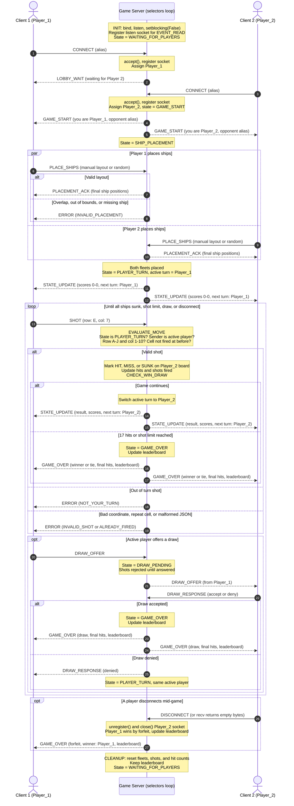

```mermaid
sequenceDiagram
    autonumber
    actor C1 as Client 1 (Player_1)
    participant S as Game Server (selectors loop)
    actor C2 as Client 2 (Player_2)

    Note over S: INIT: bind, listen, setblocking(False)<br>Register listen socket for EVENT_READ<br>State = WAITING_FOR_PLAYERS

    C1->>S: CONNECT (alias)
    Note over S: accept(), register socket<br>Assign Player_1
    S-->>C1: LOBBY_WAIT (waiting for Player 2)

    C2->>S: CONNECT (alias)
    Note over S: accept(), register socket<br>Assign Player_2, state = GAME_START
    S-->>C1: GAME_START (you are Player_1, opponent alias)
    S-->>C2: GAME_START (you are Player_2, opponent alias)
    Note over S: State = SHIP_PLACEMENT

    par Player 1 places ships
        C1->>S: PLACE_SHIPS (manual layout or random)
        alt Valid layout
            S-->>C1: PLACEMENT_ACK (final ship positions)
        else Overlap, out of bounds, or missing ship
            S-->>C1: ERROR (INVALID_PLACEMENT)
        end
    and Player 2 places ships
        C2->>S: PLACE_SHIPS (manual layout or random)
        S-->>C2: PLACEMENT_ACK (final ship positions)
    end

    Note over S: Both fleets placed<br>State = PLAYER_TURN, active turn = Player_1
    S-->>C1: STATE_UPDATE (scores 0-0, next turn: Player_1)
    S-->>C2: STATE_UPDATE (scores 0-0, next turn: Player_1)

    loop Until all ships sunk, shot limit, draw, or disconnect
        C1->>S: SHOT (row: E, col: 7)
        Note over S: EVALUATE_MOVE<br>State is PLAYER_TURN? Sender is active player?<br>Row A-J and col 1-10? Cell not fired at before?
        alt Valid shot
            Note over S: Mark HIT, MISS, or SUNK on Player_2 board<br>Update hits and shots fired<br>CHECK_WIN_DRAW
            alt Game continues
                Note over S: Switch active turn to Player_2
                S-->>C1: STATE_UPDATE (result, scores, next turn: Player_2)
                S-->>C2: STATE_UPDATE (result, scores, next turn: Player_2)
            else 17 hits or shot limit reached
                Note over S: State = GAME_OVER<br>Update leaderboard
                S-->>C1: GAME_OVER (winner or tie, final hits, leaderboard)
                S-->>C2: GAME_OVER (winner or tie, final hits, leaderboard)
            end
        else Out of turn shot
            S-->>C1: ERROR (NOT_YOUR_TURN)
        else Bad coordinate, repeat cell, or malformed JSON
            S-->>C1: ERROR (INVALID_SHOT or ALREADY_FIRED)
        end

        opt Active player offers a draw
            C1->>S: DRAW_OFFER
            Note over S: State = DRAW_PENDING<br>Shots rejected until answered
            S-->>C2: DRAW_OFFER (from Player_1)
            C2->>S: DRAW_RESPONSE (accept or deny)
            alt Draw accepted
                Note over S: State = GAME_OVER<br>Update leaderboard
                S-->>C1: GAME_OVER (draw, final hits, leaderboard)
                S-->>C2: GAME_OVER (draw, final hits, leaderboard)
            else Draw denied
                S-->>C1: DRAW_RESPONSE (denied)
                Note over S: State = PLAYER_TURN, same active player
            end
        end
    end

    opt A player disconnects mid-game
        C2->>S: DISCONNECT (or recv returns empty bytes)
        Note over S: unregister() and close() Player_2 socket<br>Player_1 wins by forfeit, update leaderboard
        S-->>C1: GAME_OVER (forfeit, winner: Player_1, leaderboard)
    end

    Note over S: CLEANUP: reset fleets, shots, and hit counts<br>Keep leaderboard<br>State = WAITING_FOR_PLAYERS
```
